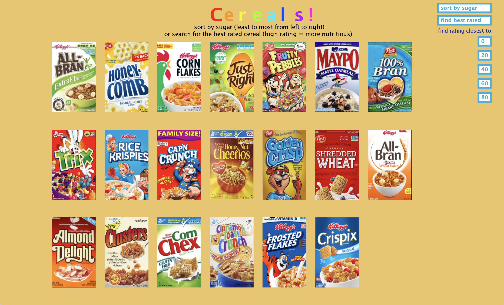
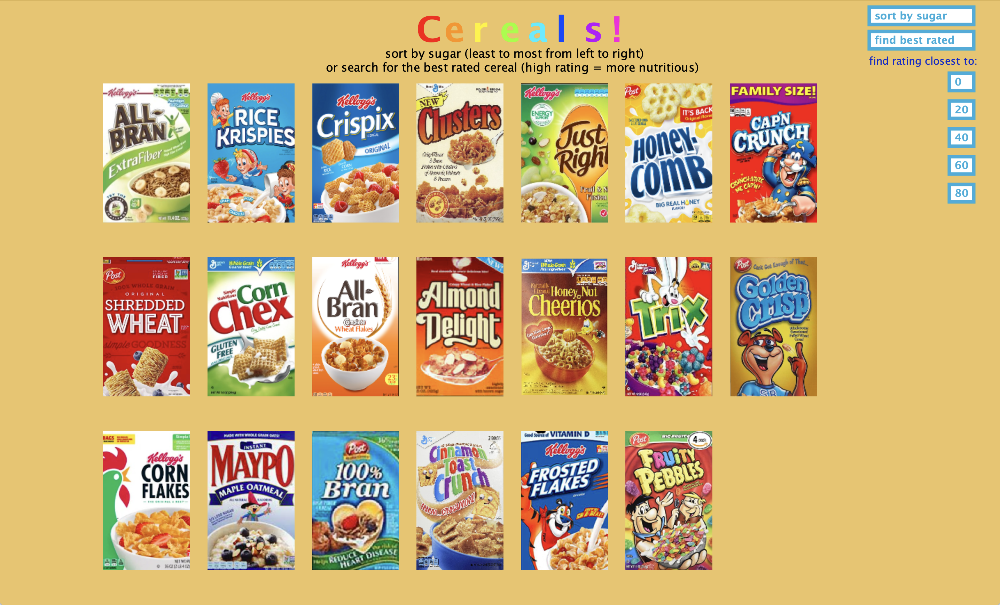
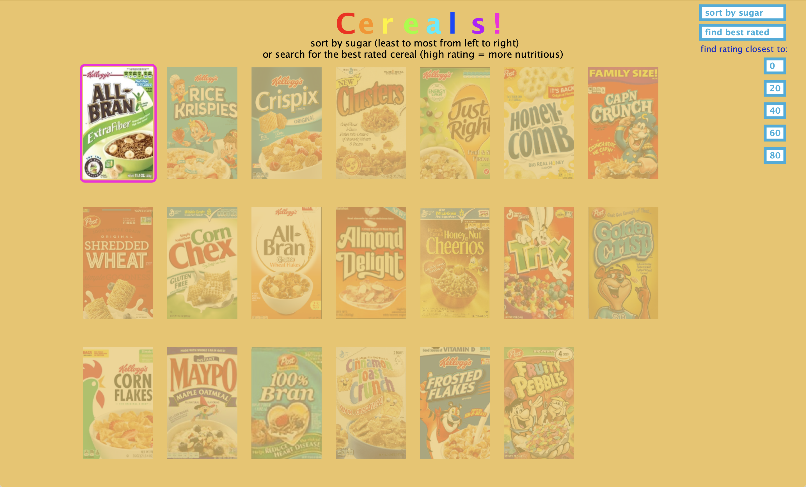
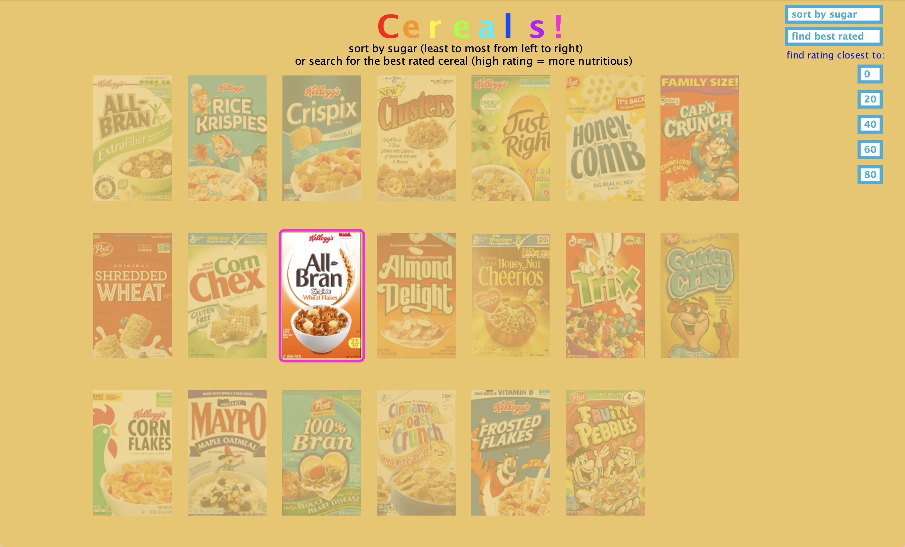

[](https://www.java.com/)


# Cereal Data Visualization

Java desktop data visualization app that turns a small cereal dataset into an interactive, image-driven interface where users can sort cereals by sugar content and search for standout ratings.

## Preview

<div align="center">
  
</div>

Default view of the application, showing the full cereal grid and the controls for sorting by sugar, finding the best-rated cereal, and searching by preset rating targets.

## Overview

This project explores how a lightweight desktop UI can make a dataset easier to understand than a spreadsheet alone. Instead of reading rows in a CSV file, the user sees 20 recognizable cereal boxes and can interact with the data through sorting and search controls.

This project demonstrates:

- Building a custom Java Swing interface with `Graphics2D`
- Loading and modeling CSV-backed data and image assets
- Implementing sorting and search behavior on top of a simple domain model
- Turning a static dataset into a more visual, exploratory experience

## Core Features

- Displays 20 cereal records backed by a CSV dataset and cereal-box image assets
- Sorts cereals by grams of sugar per serving
- Highlights the best-rated cereal in the dataset
- Finds the cereal with rating closest to preset targets: `0`, `20`, `40`, `60`, and `80`
- Uses dimming plus a focused outline so the selected result stands out from the rest of the grid
- Organizes the code around `Dataset`, `Record`, `Sortable`, and `Searchable`

## Screenshots

### 1. Sorted By Sugar

<div align="center">
  
</div>

After clicking `sort by sugar`, the cereal boxes are reordered from lower to higher sugar content. This view emphasizes the project's sorting logic and makes nutrition differences easier to compare at a glance.

### 2. Best Rated Highlight

<div align="center">
  
</div>

After clicking `find best rated`, the app highlights `All-Bran_with_Extra_Fiber` while dimming the rest of the grid. The focused outline makes the search result easy to locate without losing the surrounding context of the full dataset.

### 3. Closest-Rating Search

<div align="center">
  
</div>

This example shows the result of the preset rating search. Selecting one of the rating buttons highlights the cereal whose rating is closest to the chosen target, demonstrating the app's search behavior on a fixed dataset.

## Dataset And Design Notes

- The visualization is based on an adapted version of the [Cereals Data dataset on Kaggle](https://www.kaggle.com/datasets/ncsaayali/cereals-data/data).
- I narrowed the data down to the fields used by the app: cereal name, manufacturer, type, sugars, and rating.
- I kept the dataset to 20 cereals so the interface stays readable and each item remains visually identifiable.
- Each row is paired with cereal box art so the visualization feels more immediate than a plain table.
- The project was influenced by data storytelling work that gives each item a strong visual identity instead of reducing everything to bars or rows.

## Tech Stack

- Java
- Java Swing / AWT
- `Graphics2D` for custom rendering
- CSV data loading
- `ImageIO` for cereal image assets

## Local Setup

1. Install a JDK.
2. Clone or download this repository.
3. From the project root, compile the source files:

```bash
javac src/*.java
```

4. Run the app:

```bash
java -cp src CerealVisualizationApp
```

5. Keep the `src/data` directory in place so the CSV file and cereal images can load correctly.

## Credits

- Dataset adapted from the [Cereals Data dataset on Kaggle](https://www.kaggle.com/datasets/ncsaayali/cereals-data/data)
- Visual inspiration: Nadieh Bremer's Top 2000 visual storytelling work
